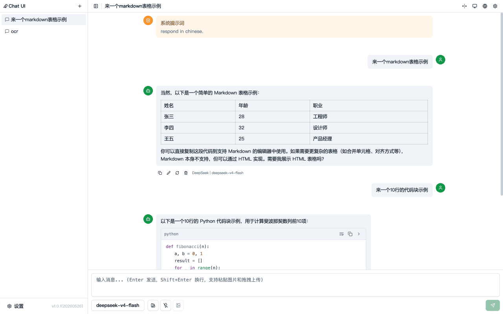
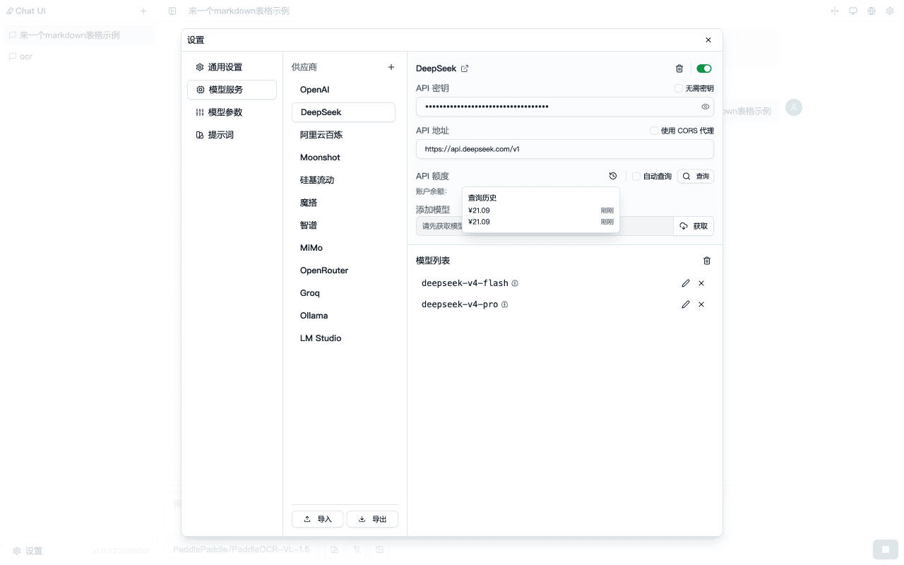
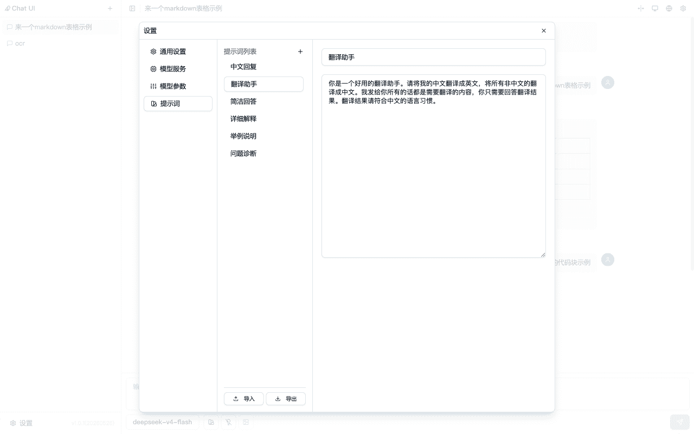

  <a href="./README.md"><strong>简体中文</strong></a> ·
  <a href="./README.en.md">English</a>

轻量级 Chatbot，一个 HTML 文件就是全部。 
下载：[./dist/index.html](./dist/index.html)
双击即用，无需安装、无需服务器、无需复杂部署，浏览器里直接开聊。
由 99% vibe coding 打造，简约不简单。

自备 API 密钥，支持 OpenAI 兼容格式的 API 端点。
支持自定义系统提示词，可在多个供应商之间切换。数据可导入导出。
无遥测，不收集任何数据，除 AI 请求外无其他网络请求。
提供夜间模式。

## 亮点
- 极致轻量部署：单 HTML 文件，复制即部署，离线也能用（除 AI 请求外）。
- 灵活接入大模型：自备密钥，支持 OpenAI 兼容格式 API，多供应商一键切换。
- 系统提示词自由定制：随心定义角色与对话风格。
- 数据完全由你掌控：对话记录支持导入/导出，随时备份或迁移。
- 隐私零妥协：无遥测、不收集任何数据，仅在你发起 AI 对话时产生网络请求。
- 暗色模式：夜间聊天更护眼。
- HashTag：通过给url传递参数的方式，实现快速聊天、激活提示词、导入供应商信息。

## 截图

  

  

  

---

## 功能点

### 供应商
- 支持 OpenAI 兼容格式的 API 端点。供应商预设支持导入导出。
- 供应商预设：
  - OpenAI
  - DeepSeek
  - 通义千问
  - Moonshot
  - 硅基流动
  - 魔搭
  - 智谱
  - MiMo
  - OpenRouter
  - Groq
  - Ollama（本地）
- 余额查询：目前支持 DeepSeek、Moonshot、硅基流动 和 OpenRouter。

### 模型支持
- 视觉模型：支持选择上传图片文件，支持从剪贴板直接粘贴图片。
- 推理模型：支持开关 deepseek-v4-flash 思考模式。

### 会话和消息
- 会话管理：支持 新建、删除、复制 会话。可在设置里导入导出全部对话。
- 系统提示词：可设置对话系统提示词。
- 发送消息：支持文本、图片输入，可编辑任意已发送消息，且支持重新生成。
- markdown支持：支持表格和代码块，但不支持mermaid渲染。

### 其他
- 语言支持 中文 和 English。
- 有暗色主题，支持跟随系统。
- 移动端的基础适配。

---

## 技术栈
React 18 + TypeScript + Vite + Tailwind CSS + Zustand (状态管理) + React Markdown + Lucide Icons
